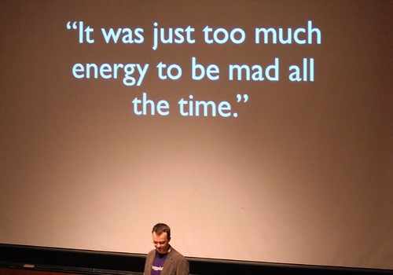

  
Why people stop bloggingThe other day, I wrote [a pretty detailed article on my frustrations with how people have been using my Flickr photos](http://www.migratorynerd.com/2007/07/13/creative-commons-flickr-and-you/), all of which are associated with a creative commons license. In that article, I had an interview with the Vice President of Creative Commons where we discussed what proper attribution means, and some of the grey areas associated with the non-commercial parts of the CC licenses. A few days after I wrote it, [Darren Barefoot chimed in with some of his thoughts](http://www.darrenbarefoot.com/archives/2007/07/the-practicalities-of-flickr-and-creative-commons.html) — there is a really good comment thread over there, so go check it out.

Just this afternoon, I was commenting to Rebecca online that I’m growing tired of seeing inbound links to my blog from news aggregators. If I felt these aggregators were around to provide a relatively cohesive website for a particular topic, I might support them. But most of the ones that link to me are simply trying to make a profit on advertising, and that bothers me that other people are using my work to try and make money. To counter that, I have explicitly stated on the bottom of my blog (in the footer) that the works on this website are protected under a CC non-commercial license. I don’t mind other people cutting pieces out of my articles to support intellectual blog entries of their own (assuming they do proper attribution), even if they have adsense (because I have some here on my buried pages), but I’m going to deliberately clamp down on unholy aggregators, or people who I feel are simply lifting blog entries of mine.

Which brings me to something that happened a few minutes ago. [Rebecca](http://www.miss604.com) pinged me on iChat and sent me a link to [VancouverGo.com](http://vancouvergo.com) and showed me a blog entry of theirs that they had essentially cut and paste from her website (not just the text, **but the entire HTML body of the entry**). And while they put a text version of her HTML link as an aside, it wasn’t a real, clickable hyperlink. 100% of the article that they posted was written by Rebecca, and the author of VancouverGo didn’t add a single sentence of their own. In my mind, that’s completely wrong. If you want to let people know about something interesting on someone else’s blog, then link back to the blog entry itself, don’t cut and paste the entire entry for your own blog — how hard is it to write something original on your own?

I’m really starting to get worried about the world of blogging. Too many people think they can just take the fruits of other people’s labours and save themselves having to do any real work.