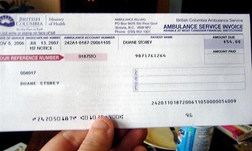

This morning I went downstairs and checked the mail, and was surprised to see a bill from the ministry of health. It would seem that the government wants me to pay for the ambulance that took me to the hospital the night I ended up with multiple lacerations to my head and face, and five broken bone segments in my face. While I’m obviously appreciative for our medical system, considering I have had two surgeries now that I haven’t had to pay for, given that our health care system is supposed to be covered, I’m pretty surprised that I have to pay this at all.

  
