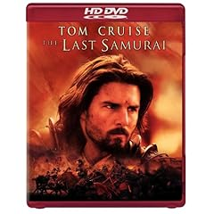

A while, I posted an article on my recent purchase of a [Toshiba HD-A2 high-definition DVD player](http://www.hometheaterblog.com/hometheater/2007/01/toshiba_hda2_re.html). Since that time, I have slowly been figuring out just what to do with it. After purchasing it, I sort of assumed that it would be easy to rent HD-DVD movies, but it’s actually still rather tough. Blockbuster recently announced [an exclusive deal with Blue-Ray so that they would only carry Blue-Ray titles](http://www.itwire.com.au/content/view/12942/1085/). And while a few people have said that it’s most likely the death-blow to HD-DVD, I disagree.

For starters, the [adult film industry has put its weight behind HD-DVD](http://arstechnica.com/news.ars/post/20070112-8602.html), which is my mind is a rather good industry to have in your corner. And [Zip.ca](http://www.zip.ca), one of the larger online DVD rental companies, [recently said this](http://www.zip.ca/zipnews.aspx?newsID=2554):

> “The format fight will only end when the two sides reach agreement, or when consumers have voted with their dollars,” he said. “As yet, there is no clear evidence that consumers are picking one format over the other.”
> 
> Over the past month, 56% of next-generation rentals at Zip were HD-DVD versus 44% for Blu-ray, he said.
> 
> “This is not yet resolved, no matter how much you, we and Blockbuster all wish it was.”

For now, I’ve resolved myself to using the Zip.ca service to order HD-DVDs online, since they are next to impossible to rent in this city. I’m paying $25 a month, which is still alot better than the $80 I was paying for cable, and am entitled to up to 11 movies a month with that plan. Since they have a Vancouver distribution branch now, I received my first batch of four movies in only two days, so I think this is going to work out quite well.

If you’ve never used an online rental service before, it’s really pretty slick. You pick a bundle of movies (in the case of Zip.ca, your “ziplist” contains at least 20 movies), and as soon as you return a movie, they’ll ship you the highest movie of your ziplist that is available.

In terms of video quality, it’s really quite impressive. I’ve sort of gotten used to watching things in HD over the last year, so it wasn’t a huge shock to me that the picture quality would be outstanding. I went out to Future Shop today and bought my first HD-DVD.

What’s interesting is that for some reason, a lot of the HD-DVDs come packaged in double-cases where you get the HD-DVD version of the movie, as well as the normal DVD version. I have to ask the question — why? If I have a HD-DVD player, why in the world would I want to pay a bit more and have the normal DVD version? Is this insurance in case they lose the format war, so that you’ll always have a version of the movie, even if your HD-DVD player becomes obsolete, and you switch to Blue-Ray?