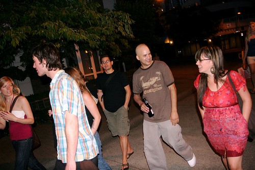

[Tony Pierce](http://tonypierce.com/blog/bloggy.htm) is currently in town checking out some of the Canadian sights and trying his hand at drinking Canadian beer. Tonight Tony, Robyn, [Rebecca](http://www.miss604.com), [John](http://www.audihertz.net/blog), [Keira](http://www.keira-anne.com), Adam and [Corinna](http://www.gusgreeper.com/) all came down to my place for some pre-fireworks drinking.

  
  
I wasn’t up to my typical drinking self, but I still managed to demolish 6 or 7 beers in fairly short order. I didn’t really eat any type of supper, so I’m a bit hungry now. On Friday some of us are going to meet up after work for a longer version of tonight, with hopefully a larger group.

  
  
It was a cool night though, and it is the first time since owning my digital SLR that I’ve actually attempted to take some photos of the fireworks. Some of us are gonna hopefully check out Saturday’s as well to see how they compared.