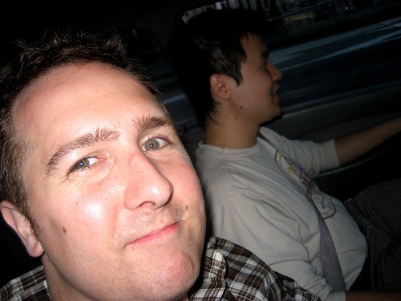
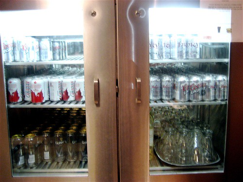

So, after work tonight I hit the bar with a few of the guys from work.. I feel great. I haven’t been this exciting about anything in a long time. I am pretty excited to see Ottawa again, the Byward Market, the Ottawa River, Parliament, and of course, my friends Rob and Anna.

Packing and leaving on a plane are always a bit stressful for me, partially because I am sort of afraid of flying, but in this case, given that I’m gone for nearly two weeks, I was worried I had forgotten a few things. I nearly forgot all my socks the first time I tried to leave the apartment, and completely forgot my camera the second time. Thankfully I think I managed to get everything on my final way out though.

  
  
Me on Vacation  
Checking into the airport was a pain in the ass, thanks to Air Canada only having one agent checking in about 100 people. Thankfully I got through it all in about 30 minutes, and found my way into the Maple Leaf Lounge, thanks to my business class ticket.

This place is fucked. I’m surrounded by free booze and a bunch of people who love drinking it straight. Maybe they are nice people, but considering most of them are wearing suits and have given me glares, I’m sure they think I’m out of place. But whatever — I like booze, and they have some here, so we’re good to go.

  
  
“Free” Booze  
My plane leaves in about 1.5 hours, and hopefully I’ll manage to sleep on the plane. Tomorrow will undoubtedly consist of lots of booze and a few reunions, and I honestly can’t wait. Boris gets into town around 6pm, and apparently we’re all going to dinner and then onward to a night on the town. Most of the business class seats on planes these days have full outlet power, so hopefully I’ll be able to write a few entries on the plane.

I’ll check in next time, probably in the Toronto Airport on my way to Ottawa. Keep it real readers!

Ps – I’m gonna web 2.0 the hell out of my vacation. So, make sure you a) subscribe to my RSS feed (Since I pump photos in there that I don’t put on my blog sometimes) and b) check out my [flickr stream](http://www.flickr.com/photos/duanestorey).