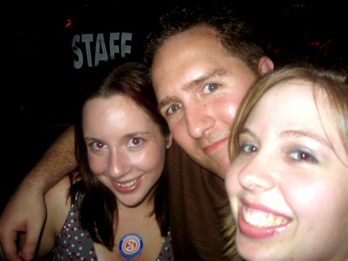
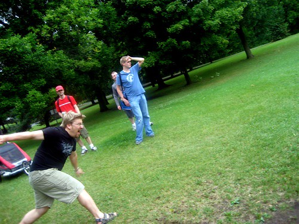
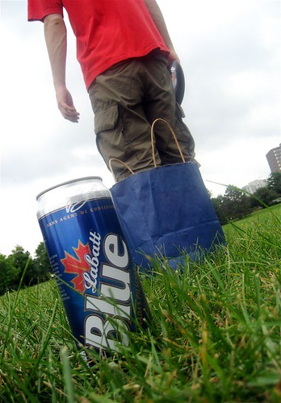

I managed to convince the hotel staff to give me a room at around 10:30am yesterday, which meant I could finally grab a few hours of sleep. I woke up close to 3pm, which meant I only had an hour or so before I had to head down to Manotick for the wedding rehearsal. I did a quick tour of downtown Ottawa with the time I had, took a few photos, and then got picked up by Alison.

Afterwards, we all headed down to Collenade Pizza about one block from where I used to live in Ottawa. Thirty of us proceeded to catch up on lost time, eat lots of pizza, drink beer, and in general have a really great time. Afterwards, Boris and I took his cowboy hat on a tour of the Byward Market.

  
  
Duane, Boris, some girls and a cowboy hat  
This morning we woke up at around 9:30am and proceeded to get ready for an early morning of drunken disc golf in Quebec. Rob picked us up in the rental “Drink-O-Van”, took us to the depaneur for some early morning beer purchase, and then hit the course. I had never played disc golf before, but I had a really good time. Unfortunately, I pretty much suck at playing disc golf, but the beers and laughter made it all worth while.

  
  
Boris throwing a long one  
  
  
Beer and Matt  
Tonight is the big wedding. Yours truly has been given the task of reading a poem for the masses, and then somehow figuring out how in the hell I’m going to get to Montreal for my 7am flight tomorrow. I have a few different options, not all of which are cheap. Boris and I are hoping to convince a cute french girl at the wedding to take us out that way for a tour. We’ll see though.

In less than 24 hours I’ll be enjoying a beer in the 34C weather in the Dominican Republic. Next blog entry might be in Dorval early tomorrow morning, but if not, I’ll check in from the Caribbean!

Ps – the poem I am reading:

> These are the hands that will countless times wipe the tears from your eyes; tears of sorrow, and tears of joy. These are the hands that will hold your children with care. These are the hands that will help you hold your family as one. These are the hands that will give you strength when you need it. And lastly, these are the hands that even when wrinkled and aged, will still be reaching for yours, still giving you the same unspoken tenderness with just a touch.