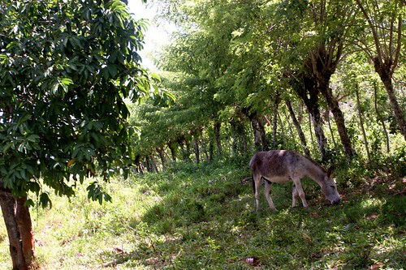
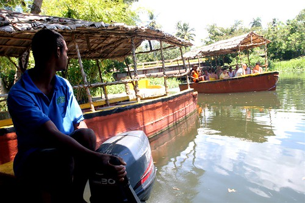

To be honest, I’m not such a big fan of pre-arranged adventures at resorts. I’ve been on a few, and most of them are pretty basic and you kind of feel like it wasn’t money well spent. However, I heard a lot of good things about the safari adventure, so I decided to check it out for the low price of $60 USD.

We left the resort at 9am, and proceeded to head into the lush Dominican Countryside. It was absolutely gorgeous, full of rolling hills, lush green vegetation, and a ton of friendly Dominican people. The safari jeep was loaded to the brim of soft drinks and booze, and nobody had an empty glass the entire time. I have spent most of my time here stuck by the pool, which is nice for a few days, but to actually hit the road and actually get to see some of the sights was pretty awesome.

  
  
To keep this short, I saw a DR home, a DR school, did a riverboat tour of a popular DR river, hit a fruit plantation to eat some sugar cane and fresh fruit, and also a rum factory. It was awesome!

  
  
Tomorrow is a boat trip to Paradise Island — should be awesome as well!