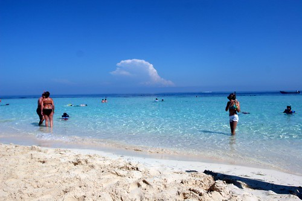

This is, unfortunately, my last full day at the resort. Tomorrow I get to wake up, pack my bags, and start the long journey back to Vancouver. While this place is really pretty amazing, I always get a bit excited whenever I get on a plane that’s heading for home.

  
  
I get into Montreal tomorrow evening, and will be staying overnight in a nice hotel near the airport. While the rooms here are fairly nice, the beds are unanimously hard and I haven’t had the best sleeps. Hopefully the bed in the Hilton is nice and soft so I can get a really great sleep tomorrow night.

I was originally going to have to get to Ottawa (by plane or bus or something) on Monday for a 4pm flight, and then have a three hour layover in Toronto. That would have put me at my place in Vancouver at around 10:30pm at night, which kind of sucked. So I called Air Canada the other day and told them my situation — believe it or not, they actually managed to help me out. So instead of doing a milk run on Monday, I’m going to be flying directly from Montreal to Vancouver, putting me back home shortly after noon. The only down side is I had to give up my business class seat, but at least I’ll be home at a reasonable time, and have nearly a full day to unpack, do laundry, and relax.

I’m going to spend today relaxing by the pool and doing a bit of shopping in the Plaza. Next entry will probably be in Montreal, or maybe even when I’m back home.

\*\* Small update. When you arrive here, you have to buy a $10 Tourist visa in order to enter the country. When I walked into the baggage area, some guy took mine from me. What’s weird is everyone else still has theirs, and apparently you need to present it in order for them to allow you to leave the country. So, I’m not really sure what happens now. I imagine there’s something in place for when this happens, but it’s probably going to be a pain in the ass to deal with tomorrow. I’m going to get some extra US cash in the morning just in case I need to buy a new one on the spot or something.