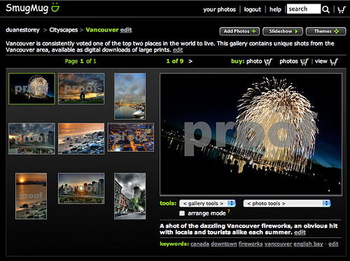

One of the first things I wanted to do after getting back from my vacation was to finally put together an online place for people to buy a few prints of some of my better shots. I’m not entirely sure I’ll make a dime, but lots of people have asked me if I sold some of my city shots, so now I can finally say that I do.

  
  
If you want to check some of them out, you can check out [photography.duanestorey.com](http://photography.duanestorey.com). If you have a blog and want to help advertise, that would be awesome. I’ve put on some google adwords, so if anyone does a search for Vancouver specific photos, I should start coming up now.

Since today was the first day I received a paycheck for taking photos, and also the day I’ve launched a site dedicated to selling prints, it’s obviously a pretty pivotal moment. Thanks for everyone’s support!

**Ps, if anyone wants to join smugmug, enter my coupon code of or8hpTynn0RGk — it should save you some cash**