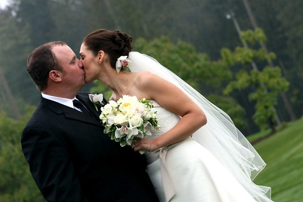

Last night I had the chance to photograph the wedding of two of my old friends. It was a great experience, and I’m fairly satisfied with how the photos turned out, considering how dark it was both outside and inside the reception area.

  
  
I’ll do a full write-up on everything I learned about shooting a wedding, but right now I have a turkey to eat. I shot over 1000 shots at the wedding, and I’ve slowly been sorting them. I put about 150 or so of them [on Flickr if anyone is interested](http://www.flickr.com/photos/duanestorey/sets/72157602301321991/). There are still more I have to process and put together, but there’s enough that it’s fairly good representation of the night.