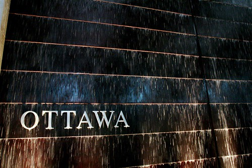

Slight change of plans. I was originally going to go to Toronto on the 26th, but I’m going to go to Ottawa the week before for work. So, I’ll be bouncing into Toronto on the 26th, but instead of coming from Vancouver, I’ll be coming in on a flight from Ottawa. That will put me into Toronto several hours earlier, which should take a bit of pressure off with having to get downtown from the airport.

  
  
I’ll be staying out in [Kanata](http://en.wikipedia.org/wiki/Kanata,_Ontario) in a really great hotel called [The Brookstreet Hotel](http://www.brookstreethotel.com/), which just happens to be owned by [Terry Matthews](http://en.wikipedia.org/wiki/Terry_Matthews) (whose company recently merged with ours). Apparently Terry and/or the company out there has box seats in Scotia Bank Place (formerly the Corel Center), so I’m crossing my fingers that I might actually get to see a game out there.