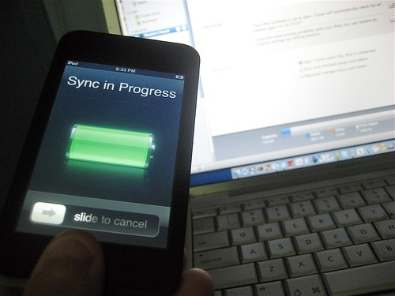

A few weeks ago I went down to the Bell Mobility store and asked how much longer I was shackled to their service. Unfortunately, it’s on the order of two more years, which means I really can’t get a iPhone and switch to Rogers (although, I’m still not sure that’s a great option either).

So tonight, while talking to Jason, he was telling me about his recent iPod Touch purchase. It’s basically the same as the iPhone, except it doesn’t have a camera or obviously a phone. But the user-interface is roughly the same, and it has Wi-Fi, so you can surf the web wherever you are.

  
  
The first thing I have to say about Apple is I how much I appeciate the effort they take in reducing their packaging size. Seriously, the packaging is hardly much bigger than the device itself, which I think is really cool.

The next thing I’m going to say is that I’m not really a huge fan of the stainless steal back on the iPod Touch. After holding it for a while, you can clearly make out a pile of fingerprints on the back. I mean, Apple ships a cloth with the device so you can clean it — clearly that points to something that can be done better.

And now for my biggest pet peeve at all — Apple, are you listening? For crying out loud — **make some black headphones**! The white headphones looked cool on the generation one iPods that were all silver, but seriously, it looks silly on a nearly all-black device. This goes for my last black iPod as well.

Other than that, I’ve been pretty impressed with it. The browser is actually a full-fledged browser, and you can use the device to surf using wireless G, so I think this is a really useful device when your laptop isn’t handy. I’ll take it with me to Ottawa and Toronto and play with it a bit more in the real world.