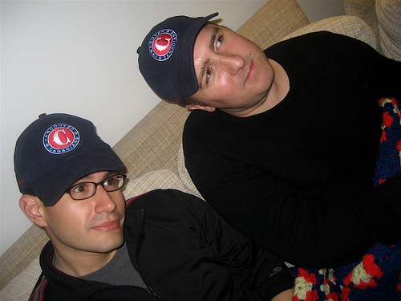
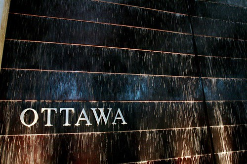

Last night I met up with [John](http://www.audihertz.net/blog) and [Rebecca](http://www.miss604.com) to watch the hockey game down at Fogg ‘n Suds. I’m not super familiar with the Canucks line anymore, so being around super hockey Canucks people is a bit intimidating. That being said, I did manage watch some of the game and to lose myself for a time in the high-ball fishbowls that they were serving there.

  
  
John and me, hanging out at John and Rebecca’s house – not sure why we put hats on  
I’m smack in the middle of packing for my trip, trying to figure out what to bring and what not to bring. As the first leg of the trip is work-related, I have to make sure to bring all the technical things I will need, which amounts to my laptop and a few mobile devices. I also am trying to gather up my camera gear, which for some reason has become fairly scattered ever since shooting that wedding.

When I normally go somewhere for more than 3 or 4 days, I usually am forced to bring a larger suitcase and check it at the airport. This time though, I think I’m just going to try and pack extremely light and hope I can get away with two carry-ons. I have a pretty cool backpack that can hold most of my camera gear as well as my laptop, so that generally takes up my first carry-on (and can usually be found stored beneath my feet on the plane). The second will of course be my weekender suitcase.

I still have a pile of laundry to do, and I can guarantee tonight will not be a late night for me. I was up until past 2am most nights this week doing some work stuff and a few things associated with WordPress, so I’m pretty exhausted. Hesty is picking me up in the morning and taking me down to the airport for my early morning flight to Ottawa.

  
  
I’m going to be stuck in Kanata most of the time I’m in Ottawa, so I doubt there will any real photo opportunities. I might try and head downtown to Ottawa one night for a few drinks with some friends, but considering I won’t have a car and it’s a good 25 minute cab ride, I’m not sure it’s really worthwhile, but we’ll see.

Next Friday morning I’ll get on a plane and head to Toronto to spend the weekend. I don’t think I’ve actually been to Toronto for about 5 or 6 years now, so it will be cool to actually be downtown again walking around. That weekend is jam packed, but I think it will be a ton of fun.

Talk to you guys in a day or two.

Hesty called me at around 8:30pm tonight and said “hey man, I’m almost there.” I was like “what do you mean?” and he was like “to take you to the airport. Are you ready?” I was like “dude, it’s tomorrow morning at 8:30am, not tonight at 8:30pm,” and Hesty was like “oh shit, I’m nearly at your place.” Oops. Anyways, it’s 12:30am, so just ignore that garbage up top about me going to bed early. Clearly I was dreaming.