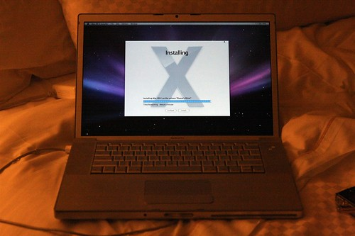

I just read an article online that did a comparison between a [bunch of different machines running Windows Vista](http://www.pcworld.com/article/id,136649-page,3-c,notebooks/article.html). You know who the winner was?

A Macbook Pro.

> The fastest Windows Vista notebook we’ve tested this year is a Mac. Try that again: The fastest Windows Vista notebook we’ve tested this year–or for that matter, ever–is a Mac. Not a Dell, not a Toshiba, not even an Alienware. The $2419 (plus the price of a copy of Windows Vista, of course) MacBook Pro’s PC WorldBench 6 Beta 2 score of 88 beats Gateway’s E-265M by a single point, but the MacBook’s score is far more impressive simply because Apple couldn’t care less whether you run Windows.

Hard to believe Microsoft and their distributors had all their shit together once.