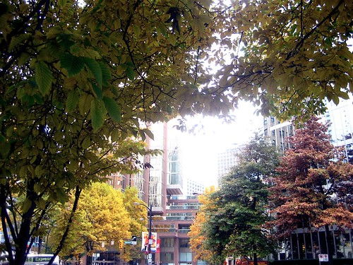
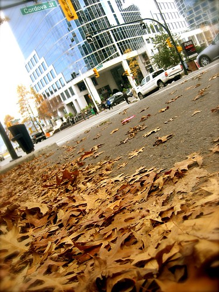
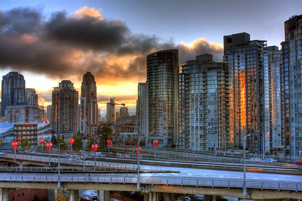

Normally I don’t take breaks at work, at least not many long ones. In fact, I usually buy a small lunch and eat it at my desk, using that brief time to catch up on blogs are read the current news.

But yesterday, I suddenly got the urge to go outside and shoot some photos in the afternoon, so that’s what I did. I didn’t have my SLR, so I just shot with my point and shoot, which is always rather depressing. No matter – here are a couple shots of a surprisingly sunny Vancouver.

  

And one this morning taken from my patio.

  
  
PS – For all of you who are expecting free prints, they’ve been in the living room ready to go for ages. I apologize. With my hospitalization and my recent trip out east, I just haven’t found time to finish that off. You will get them though.