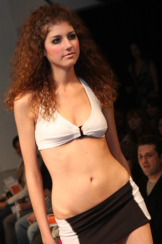

So this afternoon I headed down to a little church in east Vancouver to shoot some photos for Vancouver fashion week. Thanks to Urban Vancouver I have been able to acquire a media pass so that I basically have full access at all these events (something that I didn’t realize until today, since the pass I received today was exactly the same as the one I had on Thursday night).

Today was a mix of dresses and lingerie, and I had a really great time hanging out with some of the people I had met at the opening night gala the other day. And to be honest, while I have seen some amazing fashion and some cute girls, I’m really surprised at how unenthusiastic most of the models seem. Every once and a while you get a girl or guy who clearly enjoys what they are doing, but most people seem like they can’t wait to get off the runway, which is a bit disappointing from a photography point of view.

I put a fairly large sample of photos on my flickr set, so if anyone is interested in checking them out, head on [over here](http://www.flickr.com/photos/duanestorey/sets/72157602888568602/).

There’s an after party tonight at Crush, but I think I’m gonna pass and just take it easy tonight. But we’ll see.