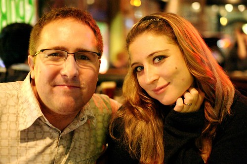
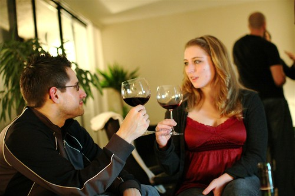

Last night I met up with [Rebecca](http://www.miss604.com) and [John](http://www.audihertz.net/blog) for some drinks at Fogg ‘N Sudds on Robson Street. It’s pretty much tradition with those two to watch any weekend hockey games down there, and whenever I can, I swing by to sample their fish bowl high ball drinks.

Afterwards, we all went over to Trevor’s house and sat around drinking wine. Trevor has a pretty cool penthouse apartment in the West End with a great view of Vancouver.

  
  
Me and Rebecca, Drinking  
And here’s a shot of John before the sleep fairy came and took him away:

  
  
Good times.

Tonight I have a birthday to go to in Kitsilano, and then tomorrow I’m heading out to Brennen’s place in White Rock for his daughter Kaede’s 1st birthday party. Should be a lot of fun.