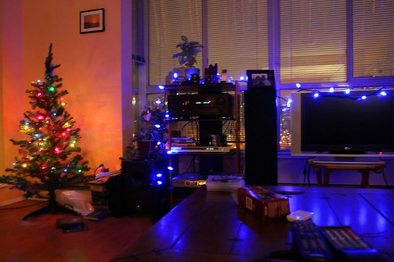

For some reason, I seem to get a lot of flack for getting ready for Christmas this early. There are those who can’t possibly believe that someone would put their decorations up in November, instead waiting until the last minute to put theirs up.

For me, I love Christmas. I love coming home and flipping on the strand alongside my main window. I love being curled up on the couch with my duvet and a good movie, having no lights on except for the dim glow of my tree.

  
[  
  
My Christmas setup last year  ](http://flickr.com/photos/duanestorey/313716331/)  
I guess part of the reason is that while in university, Christmas always went too fast. By that time, you were also extremely homesick, and putting up a few lights and some decorations somehow seemed to make studying in late December that much more bearable. Unfortunately for me, I always had exams on the last possible day, and was frequently left alone in residence, having said goodbye to most of my friends a few days before. Even the cafeteria shut down, and I was forced to fend for myself, usually by consuming vast quantities of Mr. Noodles (one of the few things you can cook without a proper kitchen).

So at home, I love having a tree up, and a string or two of lights. As the next few weeks unfold, I’m going to spend a bit more time at home watching movies, getting a few gifts for my niece and nephew, and even cooking at home from time to time.

One of my traditions is to sit at home with some friends and put on Die Hard. I’m not sure why, but that movie has somehow always been associated with Christmas for me. It’s sitting on top of my DVD player, just waiting to be played. So, stay tuned because maybe YOU will be invited to the Die Hard party! Yippee kay-ay, mother fucka.

And just to make this entry a bit more fun — what are some things that all of you are looking forward to for the holiday season?

Also, congrats to [Christie](http://www.exhausticated.com/2007/11/14/deal-with-our-return-already/) for her glorious return to the world of blogging. Glad to have you back (clearly you picked the best wordpress theme EVER to start with).