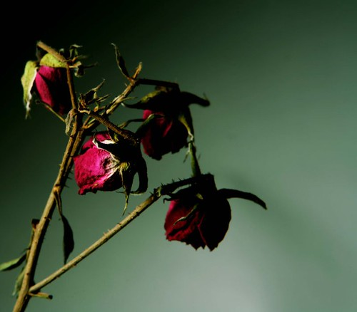

Today was a long, dreary day. I didn’t get home until around 9:30pm, and barely had enough strength to pound back some left-over lasagna. I was really looking forward to sitting back and watching heroes tonight, but mininova was down and my internet connection turned out to be pretty flaky. Today was officially full of fail.

I’ve not been feeling myself lately, and I don’t really know why. Maybe it’s the weather, maybe it’s because I’m still battling an infection, maybe it’s lots of things, but I find myself pretty bummed out the last few days. One thing that’s been bothering me lately is that I keep getting hammered from people about stupid things. I’ve gone out of my way a few times within the last few weeks to help people, only to eventually be flooded with emails asking why I didn’t do more, or why I focused on one person and not the other. It’s pretty defeating spending hours of your free time helping someone out, only to be made to feel bad for it. I really don’t know why it happens.

  
Photo By [LastExit](http://flickr.com/photos/mydnight296/) on Flickr

To add to that, lately I’ve been thinking a lot about the past. Mostly during that brief time when the lights are out and the blankets are still cold, when you gaze up blindly at the ceiling and thoughts just sort of randomly enter on their own. I’ve thought about my injury a bit, my recovery, the last few months, but mostly, for some reason, I’ve found myself thinking alot about my last real relationship, even though it was quite a long time ago now.

And the truth is, at some level, I find that I miss it all. I don’t really miss her, at least not in that capacity anymore, but I miss how it once felt. I miss the excitement, the butterflies, drinking hot chocolate and wrapping presents at 2am. I miss waking up to the smell of coffee, candlelight, or sleeping the day away on a rainy sunday. I miss hugs, or looking down and realizing that someone is holding my hand.

And while I have lots of friends, sometimes I feel like I’m meant to play a piece part with each person, even though inside I’m yearning to do the whole play – like somehow the best parts of me, the parts that you only share with someone close, are just sort of slowly wilting away in the fading light.

Maybe it’ll pass with the weather. Maybe the rain and the snow and the darkness will somehow take it all away over the next few weeks, right back to where it came from. I should be so lucky.