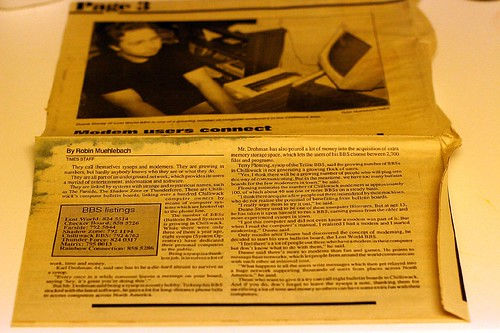

I know for a fact that Leopard seems to work fine with Apple’s router, but I’ve been having a lot of problems with Leopard and my Linksys Wireless N router here at home. Once and a while it will just give itself a self-assigned IP address and that’s that. The only way to fix it is to reboot my Mac and my router, which usually causes it to grab a real one. Funny thing is I can switch to my neighbours connection (sssh, don’t tell), and it works fine even in that state, so it’s something about the Linksys it doesn’t like.

Seems like there’s a problem with 10.5.1 and some wireless routers. Mine actually comes up in my menu as “Device” instead of where it normally is. Strange. I’ve put all the settings to default as well. Looks like I might need to go buy an Apple Airport Router thing.

I think I’m going to buy a Commodore 64 and a modem and go back to the world of BBS’s.. They seemed to work better for me.

Speaking of BBS’s — if you thought YOU were cool in high school, you better think again:

  
  
That’s an article in the town paper about some nerdy 15 year old kid who set up a BBS and let all the people in town connect to each other. Yah that’s right, I was a pretty cool cat back then. Chicks lined up for hours to meet the ever popular “Modem Man”.

Oh man, check this out -&gt; [\[thing to check out\]](http://bbslist.textfiles.com/604/), it actually even has reference to mine way back then (search for Duane Storey).