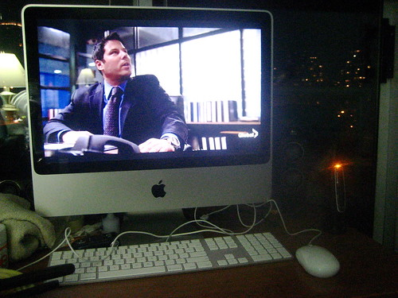

Wow. I just spent the last 30 seconds walking around my apartment looking for my laptop so I could pack it up and take it to work like I usually do. Then I remembered that I no longer have a laptop, as it’s in for servicing. Which means I can leave my big bulky bag at home today. Which is weird, and honestly, sort of feels a bit freeing. I can walk to work today and actually just enjoy the nice sunny day with my iPod.

  
  
I tried finding a nice sunny autumn shot for this entry, but this Central Park Shot came up from last year, and it made me miss New York. So enjoy.

PS – My new iMac kicks some serious ass. It’s so nice having a desktop at home again, and being able to sit in my room and listen to music with it.. Plus, the 20″ screen is also pretty decent for watching movies and TV shows. Here’s a shot of me watching Heroes last night:

  
  
And for the record, from the moment Noah got shot, I knew what was going to happen at the end of the show, although I thought they would hold it until the beginning of the next show.