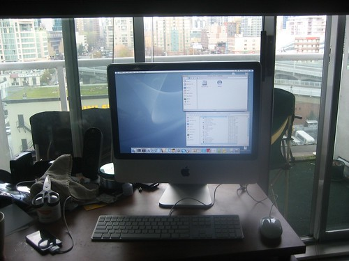

As everyone knows, I’ve spent the last six months battling my Macbook Pro. It’s been plagued with various problems, the most severe of which lately is intermittent connectivity wherever I go. Not coming back whenever it sleeps it pretty lame too.

Anyways, I went to drop it off at the repair facility, and they said it would be gone for at least two weeks. So, being the impulsive buyer that I am, I decided to pick up an iMac for home. And to be honest, I used to always use a desktop computer, even though I had a Windows laptop before. But when I got my Mac, I ended up formatting my Windows machine and turning it into a Linux server — can’t really remember why I did that.

  
  
So anyways, I now have a pretty sweet iMac at home, and it’s a nice change to have a fully working desktop machine hooked up to real speakers again. Unfortunately, my iMac came with Tiger and not Leopard, so until Leopard comes in the mail, I’ll have to make due.