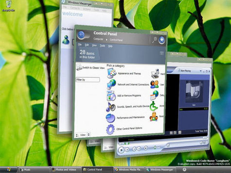

  
  
From [here](http://morningcupojoe.com/2007/02/20/windows-vista-dreamscene/)Windows Vista rated one of the [worse products ever by CNET](http://crave.cnet.co.uk/gadgets/0,39029552,49293700-10,00.htm):

> Any operating system that provokes a campaign for its predecessor’s reintroduction deserves to be classed as terrible technology. Any operating system that quietly has a downgrade-to- previous-edition option introduced for PC makers deserves to be classed as terrible technology. Any operating system that takes six years of development but is instantly hated by hordes of PC professionals and enthusiasts deserves to be classed as terrible technology.
> 
> Windows Vista conforms to all of the above. Its incompatibility with hardware, its obsessive requirement of human interaction to clear security dialogue box warnings and its abusive use of hated DRM, not to mention its general pointlessness as an upgrade, are just some examples of why this expensive operating system earns the final place in our terrible tech list.

Given that the first purchase of a Mac I made this year was basically the result of me installing Vista on my laptop, I can totally understand this.

Anyone reading this actually use Vista and like it?