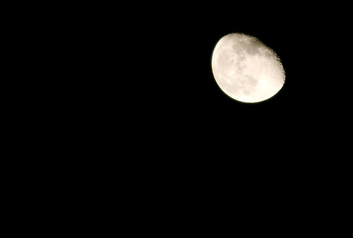

The moon looked really cool tonight, so I popped on the longest zoom lens I have in the house, the 70-200mm f/2.8L, and fired a few shots off of my balcony.

  
  
I think it turned out not bad, considering I hand held it. If I had an extender I could probably do an even better job.