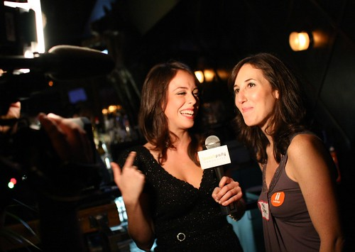

Tonight I went down to the Republic to partake in the second Launch Party. It’s basically a mixer for technology enthusiasts, and an opportunity for a few startups to showcase their new products.

There were about 150 people that probably showed up, and it got rather tight and cramped at times, but it was cool meeting a lot of the people involved, and hanging out with a few old friends.

  
The Sxip GirlsI’m still on some drugs, so I refrained from drinking, which was actually rather nice in a way since I spent $0 at the function tonight.

Maura On TelevisionI’m not really sure why the TV people were there, or even if it really was for television, but there were a few cameras rolling around with bright lights.

Some DudeI had a good night, and I’m glad I checked it out. Also, thanks to everyone who hadn’t seen me in a while who gave me a hug. .