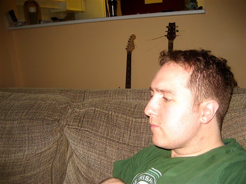

This is a pretty important week in the life of Duane. On Tuesday I’ll meet up with my plastic surgeon which might potentially be the last meeting I have with him regarding this whole affair. My first meeting was about twelve months ago and resulted in two surgeries to my eye socket. I’ve spent this last year bouncing between doctors offices, getting eye exams, several CT scans, and will meet this week to probably wrap everything up.

In terms of my vision, it’s still not perfect. I see pretty much everything perfectly below the midline (i.e. looking straight or down), but as I look up I tend to see double of everything. I have sort of naturally adjusted by automatically raising my head when looking up so the object I’m looking at is straight on, but it’s a fairly big pain in the ass for me, especially when it’s dark and my eyes are tired from a long day at work.

I had a fairly thorough eye examination a few weeks ago, and the doctor basically said that I should I’ve faired amazingly well considering the extent of the injuries I received. For the most part, I doubt anyone would really notice the changes had they never met me before.

  
  
A Few Minutes Before Mapping Out My Last Surgery  
So on Tuesday, I’m fairly certain my surgeon will basically say that’s it and close my file. If I had my way, I would probably consider another small corrective surgery which would involve adding one more piece of plastic under my eye to bring it up about 1mm and towards my nose slightly. This would probably help my vision, but of course every operation carries risks, and I’m quite certain my doctor will say it’s not worth it. When I look at getting glasses again next year, I might be able to correct some of what’s left with special prism lenses that have a vertically changing prescription, but I’m not really sure.

While most orbital floor fractures are usually correctable completely, mine is complicated by the fact that due to the kick I received in the face, my entire orbital floor (the bone under my eye) shattered, along with part of the bone against the inside of my nose. This makes it extremely difficult to properly place a plastic implant.

  
  
An Implant Sort Of Like The One I Have Under My Left Eye  
So I have no idea what’s going to happen. Some people think I’m a sucker for punishment going through all these surgeries and what not, but they have to realize that not only is my vision still affected, but I have a constant reminder every time I look in the mirror about that night. I might try to compromise with my doctor and get one more CT scan to evaluate the current position of everything. I figure with one more dose of radiation I might be able to start crawling up walls or moving objects with my mind, which would be rather cool.

On Thursday is my Christmas party, and then I think there are a few more on the weekend, so this week is shaping up to be super busy. I still have no idea what I’m going to wear for my party. Last year I think I just wore a nice sweater and some dress pants, but I think I might class it up a bit more this year. Considering I might have my new super powers by then, maybe I’ll wear all black and do some crazy jazz dance like Peter Parker.

  
  
Or not. We’ll see.