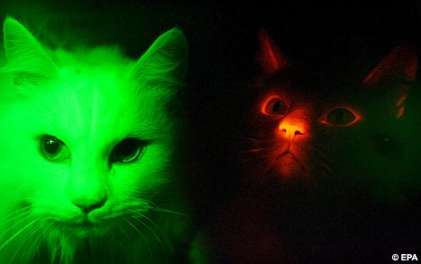

Are you trying to save energy by changing over incandescent light bulbs to CFL bulbs? Well, there may now be a new alternative that uses even less power.

Glow in the dark kitties!

  
  
Yes, you too can own one of these purring light-bulbs! Simple feed them from time to time and all your energy needs are solved!

You can [read about it here](http://blogs.usatoday.com/ondeadline/2007/12/todays-photo-cl.html).