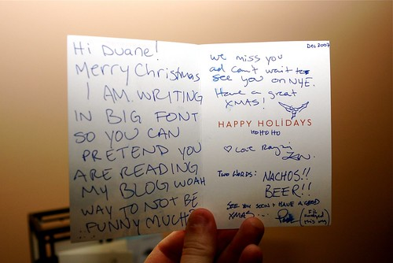

Last night I got together with some of my old high school friends for an evening of games and Christmas cheer. It was great seeing that old group again — we don’t nearly get together enough. We played “Are You Smarter Than a 5th Grader”, which was actually harder than we thought. That being said, I demolished the competition and walked away with the “you totally fucking rule” badge. The final winning question, answered by yours truly in a display worthy of it’s own Rocky film, was “What Year Was Toronto’s CN Tower Completed?”

1976 Bitches. 1976.

Tonight I’m having a few people over on a whim to sit around and eat food, have a few drinks, and of course Keira’s amazing guacamole. I’m totally not prepared for this, so I’m scrambling around trying to clean up a bit and find enough bowls for munchies.

  
  
[Santa Raymi](http://raymitheminx.com) and [Reindeer Phil](http://philogynist.blogspot.com/) sent me a little Christmas card in the mail, which I just picked up on my last visit downstairs to the lobby. Thanks guys — see you in thirteen days.