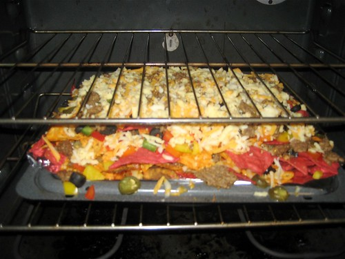
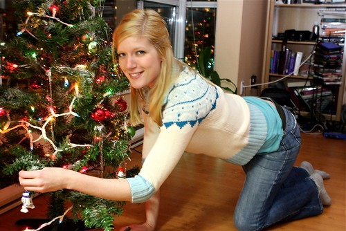
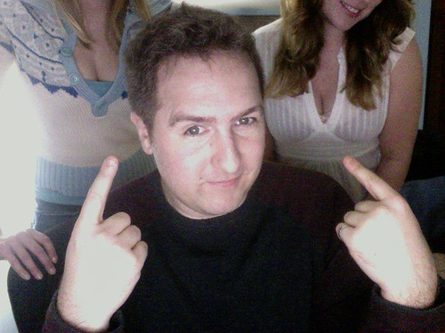

I had a few people over sort of on a whim last night, and we all sat around listening to music and enjoying Christmas nachos. I’m not sure if this is officially year two or year three for the nachos, but I’ve been trying to up the ante each year to see if I can outdo myself.

  
  
They Almost Don’t Fit  
I had a few Christmas decorations sitting around in boxes, so we all took turns throwing a few up on the tree. Keira helped herself to R2-D2, and I think I got stuck with Yoda.

  
  
Good times. Only five more days of work and then I’m off for a while. I’m getting excited about heading back home for a few days and spending time relaxing with the family.

  
  
My friend Jan will be visiting from Chicago during the break, so I’ll finally get to see him again (we haven’t gotten together since our time living in Ottawa). Plus, I think Tara will be in Vancouver, and her and I will probably get together and talk about just how cool Lord of the Rings is again.

There’s a big boxing day bash back in Chilliwack, and then shortly afterwards I’m on a plane heading out to Toronto. Since I’ll be done my anti-biotics by then, I’ll be bouncing between various bars and pubs I’m sure during those days off. Plus, I’d really like to catch a movie or two, since I haven’t done that in a while.