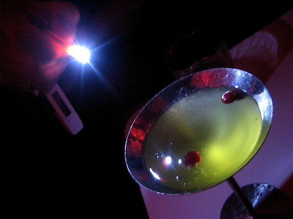

Being a single guy, every once and a while I find myself reading the personal ads in Vancouver. I used to do it thinking that there was the possibility of meeting someone online, at least someone with similar interests and what not to hang out and be friends, but it’s pretty clear most of the people on those sites these days just aren’t really the caliber of people I’m looking for. I actually met one of my girlfriends on lavalife years ago, and we hit it off and are still friends to this day, so I don’t think it’s completely unheard of (although people back then used to seem a bit more real on those sites).

  
  
The Vancouver craigslist ads are particulary pathetic, and I browse them once and a while more for entertainment value than anything. Here’s a sample from tonight’s winners:

> I’m looking for someone to spoil me, take me shopping, take me out to a nice dinner, or a movie. I’m looking for someone who’s not scared to put there money where their mouth is. I’m not saying I’m a high maintenance gal but diamonds are a woman’s best friend. I’m confident, young lady. I’m 20 years old have a killer body, thick hips, thick lips, lets just say I’m voluptuous without the extra junk, I have long brown hair dark brown eyes and chocolate brown skin.

Yes, the typical Vancouver lure — please spend all your money on me. Definitely not high maintenance. Someone should put that junk in the trash.

Here’s another winning attitude:

> Im tirred of working. i’ve been independent for a long time but im sick of it. I want to be pampered little princess that gets paid not to work! im fun and attractive. I like candy and want to do some travelling before i have kids.

I’m tired of working too. Can someone please spend all their money on me? Surely one of my readers is rich.

And lastly, let’s open up door # loser and see who’s there:

> looking for good man, financially responsible, opens doors, and treat me like the queen i am. if this turns into something more, needs be a bad boy who likes to be punished. i am attracted to men who are 5’10 and taller. weight between 185 to 240 (weight proportionate to height), clean cut, and good looking. i will only respond to emails with pictures, and even then, if i am not attracted to your pictures then i may not respond. (just a hint with regards to taking pictures gentleman…don’t do the self portrait from the video cam in front of your computer…you just look like a creepy man). get a friend to take the pictures for you…trust me it looks much better. i am an open minded go with the flow kind of gal. i love life and everything it has to offer. i love to cook, i enjoy fine wine, going camping, skiing the slopes, traveling and socializing. i do not do drugs or smoke cigarettes, i will not go out with anyone who does either. i am 5’4, average build with curves. redish blond hair and dark brown eyes.

Yes, clearly there are some diamonds in the rough waiting to be found, loved, pampered, and adored – if you’ve got the cash that is.