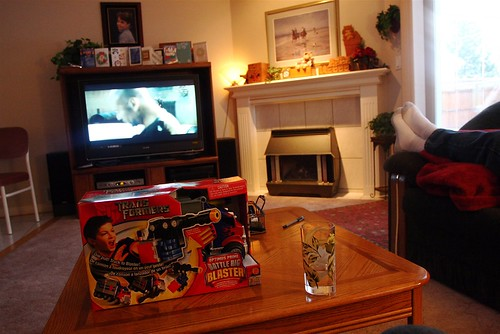
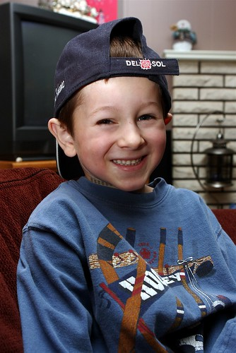
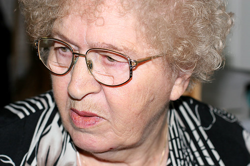

Ahh, relaxation. Definitely enjoying it. I’ve been sleeping lots, eating lots, and watching a pile of movies. For the most part, my ass has been firmly planted on the living room couch, but I’ve managed to get outside a bit and see some relatives.

  
  
Today is Christmas over at my sister’s house. Since my parents are split, today is Christmas with my mom’s side of the family. I have two gifts each for my niece and nephew, so I’ll bring one set over today and leave the other here at my dad’s for tomorrow’s round. Us adults don’t really buy for each other, but we’ve always sort of enjoyed getting the kids a few things.

  
  
My grandma (or Baba as we all call her), is a cute Ukrainian lady that has been a huge influence on my life. I spent a lot of my childhood over at her place watching The Price is Right and the Young and the Restless (not by choice). As she’s getting on in years, this year she said she couldn’t really manage to make perogies and what not for Christmas dinner. But the other day I guess she decided she really wanted me to have some since I was back in town, and spent all afternoon making me some. So, I’ll get to hang out with my grandma later and demolish a whole pile of perogies that were stuffed with pure love.

  
My Baba  
In case I don’t post tomorrow, I want to wish everyone a Merry Christmas! Drop me a comment and let me know what you’ve been up to for the holidays.

I’m leaving Chilliwack on the 27th and heading back to Vancouver for a few beers and to pack, then onwards to Toronto for a few days.