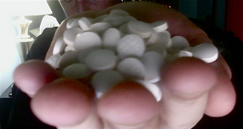
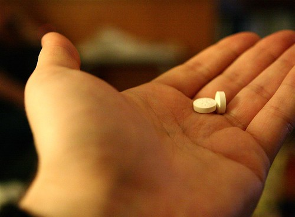

A few minutes ago, I took the last of the foul-tasting, side-effect inducing crud that I started nearly four weeks ago. The last few days have been particularly hard, and I’ve found myself extremely tired, have had a metallic taste in my mouth, and also a fairly bad migraine. While most of my family played board games tonight, I was forced to retire to the couch in the other room and attempt to out-sleep my pounding head.

  
  
168 little antibiotic goodies  
  
  
The Last 2 Out Of 168 Pills  
Hopefully in the next day or so, as the drug leaves my system, I’ll start feeling alot like my old self again. I should also be healthy again, which is the most important thing. As of tomorrow night, I will also be able to have a few beers again, which I’ll definitely need if I’m going to survive my trip to Toronto. I’ve changed my plans slightly in Toronto, and grabbed a hotel room near Bloor and Queen’s Park — that puts me within walking distance of quite a few pubs and attractions, including the Royal Ontario Museum.

Late tomorrow evening I’ll be heading back into Vancouver and getting ready for my trip. I have a pile of stupid running around to do before then, and I imagine I’ll be fairly tired Thursday night when I finally get to sleep. My flight is at 7:00am on Friday, which means I have to get up at some ungodly hour to make it to the airport. Good news is that puts me into Toronto at around 1:30pm, and hopefully into some beer shortly afterwards.

Since I’m going to be swamped until then, I doubt I’ll get a chance to do another entry before heading to the airport. You can be sure I’ll be posting a pile of photos from their though once I arrive.