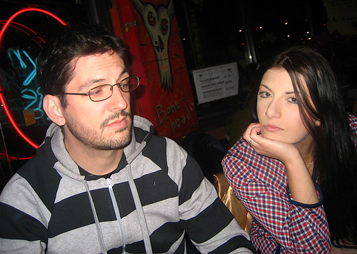
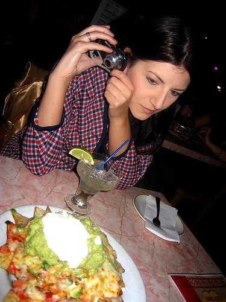
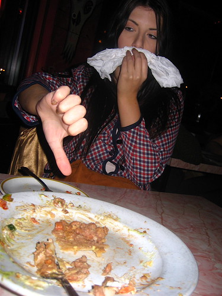
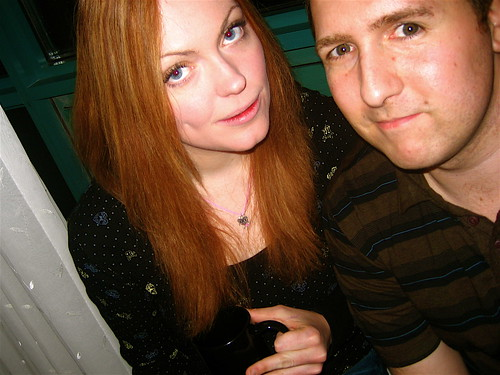

Well, judging from the beer bottles all around me and the chinese food stain on the bed, I think I had a pile of fun last night. I did my best to keep track of how many beers I had via facebook, but it looks like I lost count at the end or had trouble counting.

I went with [Raymi](http://raymitheminx.com) and [Phil](http://philogynist.blogspot.com/) to the hospital when I arrived in the hotel since she hasn’t been feeling that well. There they gave my a Christmas present, which included this cute little guy that plays the guitar (thanks guys, I’ll post a photo later).

  
  
After that, Raymi and I started our nacho-fest with some down at Sneaky Dees.

  
  
  
  
We both sort of agreed that the nachos were pretty crappy. Oh, I now seem to remember having nachos down at Gabby’s too which were alot better I think. So right now Fox and Fiddle is winning the Toronto Nacho adventure, but we’re going to have some more today I hope.

We did a little pre-party party at the hotel room, where we met back up with Christie and had a bunch of champagne, courtesy of Raymi.

  
  
I’ll have to make another run to the liquor store today because I’m pretty sure we’re all out of beer in the hotel, which seems wrong. I also think I have to spend some time cleaning this room a bit before the house keepers come in, since we did a good job of wrecking it last night.

  
  
Photo by Christie  
Afterwards we went to some club somewhere and dranks some beers and listened to some stuff. We then drove Christie home so she could sleep and recharge and came back to the hotel to eventually meet up with Tony since he was stuck in Chicago for a few hours tonight and arrived late.

I had a decent sleep, so I think today will be another fun adventure. I was up at like 6am for some weird reason, so hopefully I can adjust to the time change today.

In other news, I’ve been antibiotic free for two days now. I’ll have to get a bunch of tests in Vancouver when I get back to make sure I’m completely healthy, but I actually feel pretty good. I had cramps and what not for the week leading up to my last day of antibiotics, which had me worried. But since stopping, the cramps have gone away, so they might have just been a side-effect from the meds.