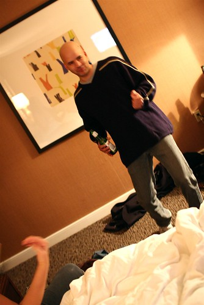
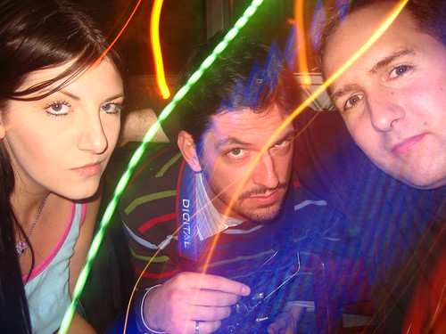
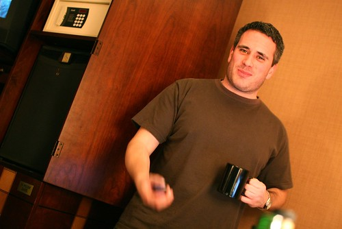

I spent most of the morning in bed on my second day of Toronto, which was fine by me since the bed here is super comfy. The rest of the day is pretty much a blur for me. Tony and I met [Christie](http://exhausticated.com) for lunch, and then walked around and did a bit of shopping. I picked up a nice scarf and Tony got some gloves and a hat, so we’re both officially winter people now.

  
  
After that I went back to the hotel and had a little nap prior to the little hockey game party we had at my hotel.

  
I wasn’t planning on getting super loaded, but somehow between the lack of food in my stomach, the martini Raymi made for me and the whack of beer I drank I ended up in a pretty drunken state. I think I’m going to take it easy tonight and rest up for the New Year’s party tomorrow night.

  
  
I’m playing around with my return flight right now as well. Currently I fly out at 7am on the 2nd and do a milk-run between Toronto, Calgary and Kelowna, which is complete stupidity. I might go back late in the evening on the 1st instead or leave a few hours later on the 2nd so I can actually get a good sleep. Not really sure what I’ll do yet.

Having a great time though. It’s been really awesome meeting back up with Raymi, Christie, Phil, Tony and Pitt again, even though I made a drunken ass of myself last night.