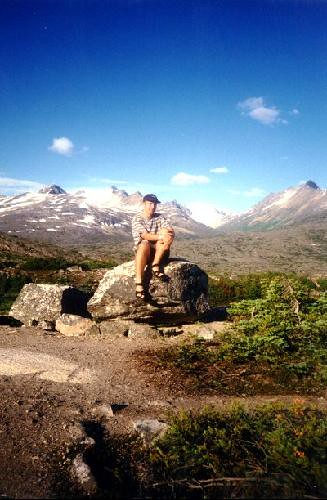

In 1997, I decided to mix things up a bit and took a summer job up in Whitehorse, YT, working at the weather station up there for Environment Canada. It was really my first time away from home in any capacity, and also marked the first time I was in a long distance relationship. Needless to say, when I walked off the plane way up north, I was a bit bummed, and a bit out of sorts.

I spent the first three days living in a hotel room, desperately trying to find a place to live, since Environment Canada only offered to pay for three days of hotel. I finally found a small room in a trailer living with this 30-something year old german lady and her crazy dog. The rent was pretty cheap, but the place was a good 45 minute walk to work. Since I had no other options, I decided to take it.

  
  
Me In The Yukon  
The first few weeks were rather lonely. Everyone at work was in their 40s, and I didn’t really do a lot of socializing. Nobody really had the internet at home back then, so I couldn’t really chat with my girlfriend back in Vancouver except for the odd letter or email from time to time (I can’t believe there was a time when I actually sent letters to people in the mail, wow). I have a stack of pseudo love-letters in a box somewhere from that summer, most of which would be rather funny to read now.

Everything changed that summer for me when I decided to volunteer for the Whitehorse annual storytelling festival, held every year on the summer solstice and meant to celebrate the native history of oral tradition. Bear in mind that at that latitude, the sun basically never set at all that night, and it’s a strange, surreal experience to be drinking outside at 2am in daylight.

  
  
Me up in Haines, Alaska  
Because of my Macdonald’s experience, I was instantly promoted to the food tent, and spent most of that weekend flipping burgers for the hungry patrons. It was there that I met Cheryl and Marilyn, two 30-something mom’s with a love for beer nearly as large as my own. Later on I would end up meeting a crazy 25 year old Newfoundlander, and we would spend most nights down at the local saloon, drinking until midnight, watching the slight dim of the sun high above the bar, but never quite setting. Back in those days I couldn’t get hungover if I tried, so it was just a daily routine of having a few pints with friends, heading home, and getting up for a full day of work.

Really, there wasn’t that much else to do up there. It sure was fun, and I had some great times.

About half-way through that summer, I came home and caught my landlady in my room rummaging through my stuff, and decided to move out ASAP. Cheryl, a single mom of four kids, offered me a free bunk to stay at in her place, knowing I was a starving student in a bind without a pile of options. And so, I moved in with a virtual stranger, and spent the rest of that summer playing Mario Kart with her kids, drinking beers with her and her family, exploring Whitehorse, Dawson City and Alaska, and eventually coming to appreciate the difference between people of substance in this world and those who are without.

I am now facebook friends with both Cheryl and Marilyn, and all of their kids. Tonight I was exchanging messages with some of them, reminiscing about the old days when I used to slaughter them at Mario Kart, giving them whatever advice I can extract from the last ten years, and thankful we are all still in touch.

It was a crazy experience that summer, one that was both difficult and exciting. Like summer camp, it is not an experience I could ever hope to reproduce, nor would I think I would ever want to try. I have often thought about going back for a visit, but I am quite sure some aspects of that summer are far better in my mind now, and I’m quite content to leave them that way.