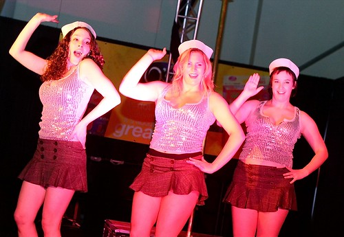
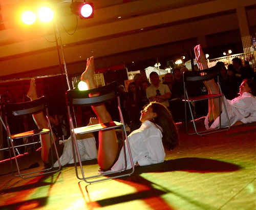
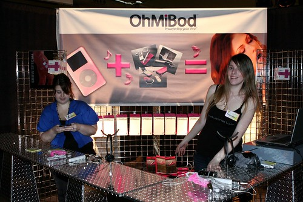
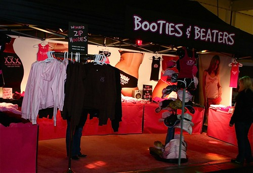

Last night, Rebecca and Trevor told me about the sex show this weekend taking place at the Vancouver Convention Center. Since I’ve never been to one, and haven’t had an opportunity to take my camera out in a few weeks, I decided to head down and check it out.

  
  
Live Entertainment  
In terms of layout and logistics, it was like any other tech conference I had ever been at. There were tons of booths, some of which made sense given the aim of the sex show, and some which obviously shouldn’t have been there. One that comes to mind is Sun Life Financial in the back corner. Seriously, do you really expect many people to sign up for a bank loan at a sex show? Maybe.

  
  
Dancers  
I walked around the entire floor maybe three times, mainly just to get a good feeling for the types of things on display and to make sure I didn’t miss anything. Most of the shops were typical things you would expect at this type of show: places selling sexual art, lube, dildos, costumes, photography services, etc. There were even a couple online dating sites there, and I was a bit surprised by how many signups they seemed to be getting during the show.

On the right side of the conference floor was an area meant for live entertainment. Most of the shows I happened to see involved trapeze acts, pole dancing, and a bunch of scantily clad girls spinning around chairs.

  
  
I tried to keep a mental list going of the booths and displays that stood out in my mind. One was of course the Bondage Bed, which seemed rather innovative:

  
  
Another one was the OhMiBod which was a vibrator that would vibrate in time to the music on your iPod. There’s an engineering award there somewhere I’m sure.

  
  
All in all, it was an interesting show, and it passed the time like I expected it too. I sort of expected a few more booth babes at this type of show, but there was definitely more of a commercial element to the show than I thought there would be. Rebecca is down checking it out as well, so I’m sure she’ll have some opinions on it as well later.

  
Some cool sexual t-shirts hereI’m going to take it easy for a few hours, then head out for some margaritas down on Denman. If you want to see some more shots from the show, [head on over to my Flickr page](http://www.flickr.com/photos/duanestorey/sets/72157603698059196/).

On another note, I’m starting to feel like there is something fairly different about low-light photography with by new Canon EOS 40D when compared to the EOS 20D. For example, I find the highlights are far easier to blow out on my 40D with high ISOs than my 20D. In addition, the noise characteristics of the 40D at ISO 3200 are way worse than the 20D IMO — on the 20D the noise seemed to be fairly random, but on the 40D it’s grouped into weird regions for some reason. I have to play around with this some more, but it’s basically a huge wrench in my photography gears right now.