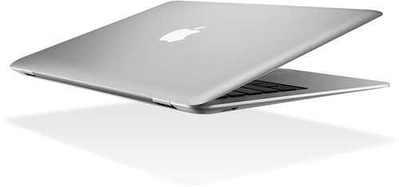

Apple just announced an ultra-think notebook computer called the Air.

  
  
Photo by [Gnackgnackgranck](http://flickr.com/photos/gnackgnackgnack/) on Flickr  
Looks pretty cool, but it doesn’t have a DVD drive, and is sealed shut like a big iPod. Based on my experiences with my Macbook Pro and Leopard, I think I’m definitely pulling myself out of the “early-adopter” crowd with Apple and waiting a while this round to see what happens.