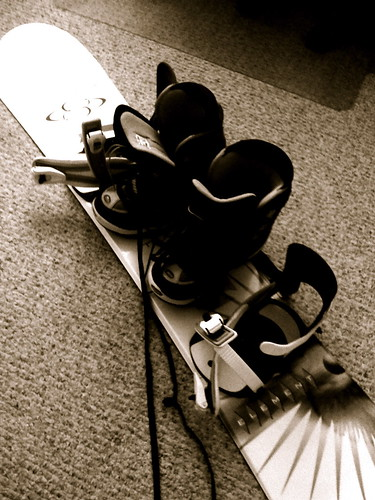

I’ve decided that I want to go snowboarding a few times this season, starting like right now. I’m definitely going to hit Seymour with Rebecca and John soon, but was wondering if any other of my crazy readers were hitting the slopes this year. If so, where do you normally go? I need people who kind of suck to go with, since I’m pretty much guaranteed to roll down most of the hills.

  
  
Snowboard, photo by [miss604](http://flickr.com/photos/miss604/)  
The good news is that I absolutely hate my powershot camera, and will happily bring it along with the hope that I will a) capture some great, funny moments of me falling and/or b) break it and have to buy a new one.

The first order of business is snow pants — I don’t have any. Maybe after work today I’ll go on a snow pant adventure.