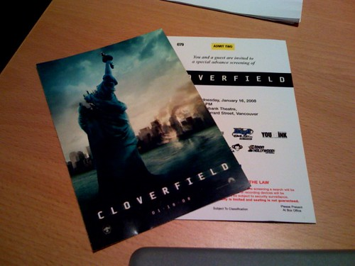

  
  
Photo by [miss604](http://flickr.com/photos/miss604)Be afraid. Be very afraid.

I’m heading out to watch this tonight with [Rebecca](http://miss604.com), [John](http://audihertz.net/blog) and [John](http://johnbiehler.com/). Rebecca had tickets to the Vancouver premiere and invited me along, which is totally exciting. I’m going on the record as saying I’m pretty sure this is going to suck (the trailer reminds me of a techy Blair Witch Project), but it’ll be a fun suck with a bunch of friends. That sounds dirty, I know.

Check out the trailer below:

  
  
I’m pretty sure the entire budget for the film went into the funky Independence-Day-looking poster, just to attract more people.