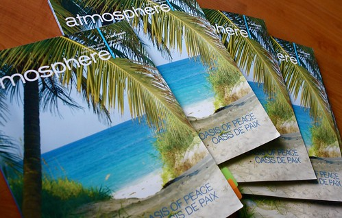
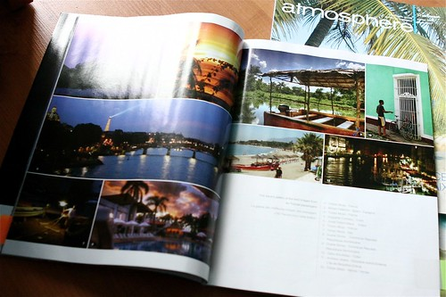

Yup, I now have proof that yours truly is in fact a published travel photographer. What does that mean? That if you have a plane, a sandy beach, and maybe a few cute locals in bikinis waiting, I’d be more than happy to come help you out by shooting some photos.

  
  
Air Transat’s In Flight Magazine, Atmosphere  
[Air Transat](http://www.airtransat.com/) sent me a few hard copies of their [Atmosphere](http://www.atmosphere-magazine.com/) in-flight magazine, since I had only heard from a friend that some of my photos made it in. Sure enough, a few of my photos from the Dominican Republic are on pages 20-21 of the Winter edition of Atmosphere. Thanks for mailing it guys, I appreciate it.

  
  
A couple of my photos on pages 20-21  
Obviously I think it’s pretty cool, as this is really the first magazine type publication I’ve had photos in. I’d love to travel to more places and take even more photos in the future.