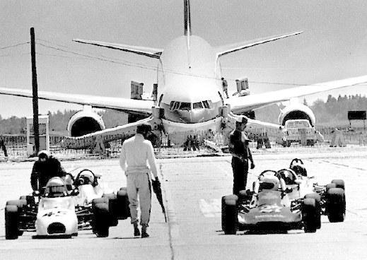

I hate Air Canada, really I do. They have screwed me over so many times and are at least partially responsible for how much I hate flying these days. [The last time they gave it to me was last year coming back from Boston](http://www.migratorynerd.com/2006/09/15/vancouvers-toast/). I arrived 90 minutes before my flight and was told that due to weather they were going to delay us a while in the airport. Since I was hungry and needed a beer, I said no problem. So, they booked me on a flight two hours later and said it would be fine.

  
  
The funny thing is even though it was raining outside, every other airline appeared to be operating normally. After dinner and beers we eventually made it onto our plane and headed out for Toronto.

We landed at Pearson at around 10:00pm at night and were supported to board a plane to Vancouver. Only one problem, there were no planes to Vancouver – last one had left an hour earlier. So the Air Canada agent in Boston had booked us on another flight knowing we would miss our connection to Vancouver and be completely stranded in Toronto. There we were, at like 11pm at night, no plane ride home and no accommodation. I asked the Air Canada rep to help us with a hotel or at least give us a food voucher or something. No go. They didn’t give a shit at all. And that was the last time I flew Air Crapada.

[Rebecca had a similar experience with them yesterday](http://www.miss604.com/2008/01/test-the-nation-trip-testing-my-patience.html), although she still made it to Toronto. Thankfully her trip was paid for by the lovely people at CBC, otherwise I’m sure she would probably be a bit more upset.

I did a quick search for the keywords “Air Canada Sucks” in Google — it came back with 192,000 pages. Here are some of the winners:

[Poor Kirsten](http://staticred.net/archives/2003/10/28/13_36_44.php):

> Kirsten just got off the phone with them… apparently they called to say that the were cancelling her flight to Baltimore (she’s going to a conference) and rescheduling it… She wasn’t allowed to know why it was cancelled, and no compensation was offered to her for the short notice… and, of course, the woman she was dealing with was a complete bag – saying, “I can cancel the flight entirely, if you’d like.”
> 
> And they wonder why people are fleeing them and going to Westjet.

More about [how much Air Canada sucks](http://towniebastard.blogspot.com/2007/06/air-canada-sucks-part-457996-in-ongoing.html):

> Air Canada sucks, part 457,996 in an ongoing series:
> 
> As if you needed more of it, here’s additional proof on why Air Canada are cock suckers.
> 
> Magically, while the airline is screwing us, they’re managing to not screw us this summer. While the ban is coming into effect on July 15, barely three weeks notice as it turns out, it won’t impact those who already have made reservations.
> 
> So Cathy can fly home with Boo on July 2 no problem. I’m curious to see if there’s going to be a racket on August 19. Yes, they’re saying you can fly with pets. Let’s see if the staff on the ground can get that straight in their heads. I have my concerns.
> 
> So the options now are:  
> 1\. Don’t fly with your pets.  
> 2\. Stick them in Air Canada Cargo, which is more expensive. I don’t have the exact figures, but I imagine it’s $50 per flight vs. something in excess of $200 per flight. On top of that, Cargo is not going to be remotely close to convenient for many passengers. Like us, for example.  
> 3\. Fly WestJet. That’s something I’d actually prefer, to be honest. They’re a much nicer airline. They do have three drawbacks, however. Not as many flights going back and forth from Newfoundland, which can mean challenges. They’re more expensive. And we don’t get aeromiles from them

And this dude, who actually compares [Air Canada to Satan](http://www.tblog.ca/?p=220):

> Back to YYC tomorrow. And after my experiences on these last two trips, I have made a vow: I’ll never travel Air Canada domestically again, and I’ll try my damndest never to user them for international travel.
> 
> They just do not deserve my business.
> 
> Here’s the setup. La Fille ™ et moi booked on the same return flight back to Cowtropolis, but being the cheapskates we are, we chose not to pay the $15 for seat selection. On a four hour fl.ight, I don’t care if I don’t get aisle. I just wanna snuggle with the right person is all.
> 
> Air Canada (aka Satan) makes it mighty hard for me to make that so.
> 
> 12 hours before the flight, we are in theory allowed to choose from any seats not already chosen through that aformentioned $15 priority seating plan. The problem is that the website is not standards compliant, and neither Safari nor Firefox is able to render the page so that I have the option to change my seat assignment.
> 
> In addition to the “Your Browser Sucks” message (no, your Web page suckz) take a look at the spacer gifs (nbsps) in the menu tabs.
> 
> Anyhow, a call to the help desk first forcfes me to listen to an ad for seat sales somewhere or other, then after a couple of menu options (no “0? to directly connect to an operator) I get put on hold for 30 minutes.
> 
> I know better than to argue with the only people that can change my seating situation, but does that stop me? At least I remain polite. Firm, yes, but polite.
> 
> Cutting to the chase, the best they can do is put us in two middle seats next to each other (B and E) and leave us to fight with neighbors to see if they wouldn’t mind switching.
> 
> It shouldn’t have to be this hard. Tomorrow AM I’ll see about trying to sweet talk our way into 1st class. In the meantime, Air Canada Sucks!. Big time.

Yes, it should be clear, Air Canada sucks the big one. I once used to really enjoy traveling with them, but I’ll pay a premium now just to not step on another one of their airplanes again.