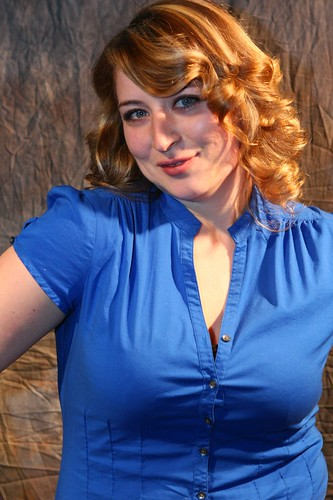
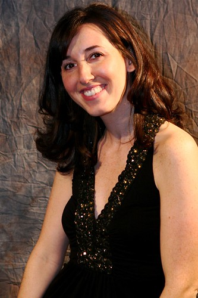

Last Friday I met a pile of people from the Vancouver technology scene down at the Lamplighter pub in Gastown. Apparently that location is surrounded in controversy, since the Lamplighter has recently changed hands and has been transformed into a more “modern” establishment. I can’t say that I ever hung out in it before, but it seemed like a pretty cool place on Friday.

I would have shown up and mingled regardless, but on Friday I volunteered to drop by and take some photos of the [Vancouver Technology Women](http://www.raincitystudios.com/blogs-and-pods/daveo/vancouver-tech-women-and-launchers-continue-surprise) for this year. That list was put together by none other than blogger-extraordinaire, Dave Olsen.

On that list was good pal and super hero, [Rebecca Bollwitt](http://miss604.com).

  
  
Rebecca Bollwitt[Maura Rodgers](http://strutta.com/about) was one of the main brains behind organizing the whole event, so a big thanks to her for putting it on (and for feeding me those free drinks all night, although my head was a tad sore the next day).

  
  
Maura RodgersIt was a great time, and I’m totally looking forward to the next one. You can check out the rest of the images in [my Flickr set](http://flickr.com/photos/duanestorey/sets/72157603801387143/). I’ll put a couple below as a little teaser: