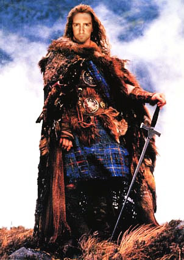

  
  
Yes, this is what I look like before I **cut off your head and steal all your powers**, bitches.

Big thanks to [Clay](http://twitchy67.wordpress.com) for misusing all our web design resources at work to make this possible. Apparently he thought the whole Star Wars thing was too retro, and came up with something better.

Thanks for supporting my cause against the evil guys against me, dude. Watch out for my sword.

PS – I’m commando under all that shit. Believe it.

Also, tomorrow is a big nerd session at my place. John Bollwitt, Boris Mann and John Biehler are definitely swinging by to drink some beers, watch some movies, and play catch-up for all the things we’ve all fallen behind on this week. It’s the unoffical “Catchup-Camp” over at my place.