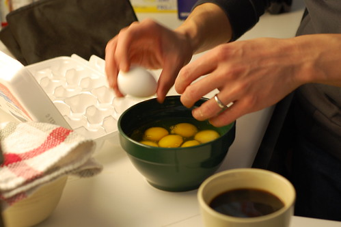

There are a bunch of guys over at my place right now, messing around with blogs, media, podcasts, and of course, beer. Right now it’s John Bollwitt, John Biehler, and Boris Mann is downstairs with the next shipment of beer. I’ll update this as the day/night goes on.

We all have a few projects we want to do. I’m currently moving all my websites over to Media Temple, which is basically easy but requires a bunch of grunt work to pull off. After that I’m going to attempt to make really awesome movie/mp3 player for WordPress.

  
  
John Bollwitt making scrambled eggs, photo by John Biehler  
Wow, the day sure went quick. It’s already 8:45pm. I’ve been working on a pretty cool WordPress plugin during the day that will automatically extract all media out of blog posts and put it into a media player. I’ll have a demo going in a few hours that I’ll put on the site.