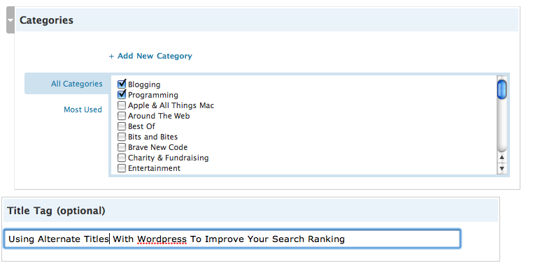

I’ve spent a great deal of time in the last few months trying to understand how search engines work, and how sites get indexed. [In my last article](http://www.migratorynerd.com/2008/02/how-to-make-your-website-faster/), I recommending that the XML Sitemap generator for WordPress should be installed on sites to help with search engine crawling. On this site, Google has gone from around 400 indexed articles (about 20%) up to around 1600 articles (about 80%) for my website — a substantial increase, entirely due to the sitemap.

I want to write briefly about WordPress title tags in the context of search engine optimization. Most default WordPress blogs are configured to output the blog name first, followed by the article title (for example, reading an entry called “Things to do in Vancouver” on the blog MyBlog would have a title that looked like “MyBlog – Things To Do In Vancouver.”

There are several problems with that approach. First, every entry that makes it into Google is going to end up with “MyBlog” as the first part of all descriptions. If that’s you, go to Google and type “site:myblog.com” substituting your blog name. Notice how all the descriptions look almost exactly the same? Plus, if you have a large title, Google is going to truncate the useful part of descripition, leaving rather useless search results for your website.

A far better approach is to reorder the title tags around so that the blog description comes first. If you’re up for editing your theme, you can try changing your title block to the following:

`  	<?php if (is_home()) { ??>  		<?php bloginfo(’name’); ??> » <?php bloginfo(’description’); ??>  	<?php } else { ??>  		<?php wp_title(â€&#157;); ??> » <php bloginfo="">  	<?php } ??>  </php>`

This not only improves the appearance of your titles in Google and other search engines, but usually improves your search ranking as well (since Google weights the beginning of the title higher than the end).

Another problem with WordPress is that your post title is the part that usually ends up in the title of the post. That’s fine and dandy if you always make clear, descriptive titles for all your posts. But not only is that often hard, it doesn’t lead to very artistic or snappy titles.

Thankfully there’s the [SEO Title Tag Plugin](http://www.netconcepts.com/seo-title-tag-plugin/) that you can download that will change the behaviour. Once it’s installed you’ll get an extra option in your WP-Admin panel where you can specify the actual html title element you want used for the post, decoupling it completely from the title the user sees in the blog entry. You’ll have to make a small change in your theme header to get that title to appear in the title tag, but it’s not very difficult.