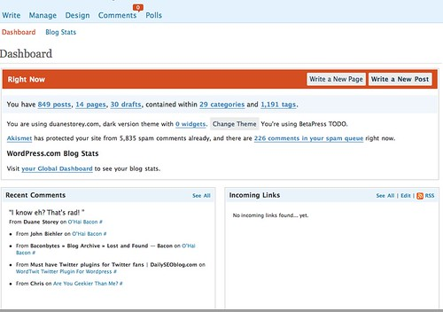
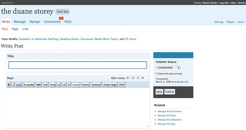

Today I took the plunge and quickly upgraded my WordPress installation from 2.3.3 to the Beta for 2.5. In terms of look and feel on the front-end, I doubt you’ll notice any major changes (especially on sites where you don’t have to login). However, they’ve completely overhauled the administration section in the back to make things a little easier to find.

I’m not going to really review it, because in all fairness it’s not quite done yet. However, the back end does seem a bit slower, maybe due to the new additions. Also, I have been completely unable to add media using the new interface. It either locks up or finishes uploading but refuses to add the link to the post data. I imagine this is one of the things they are still working on fixing.

WordPress 2.5 Dashboard

I like the overall look and feel of the back-end compared to 2.3, but I’m not so sure that it’s as functional. For example, with WordPress 2.3 I could write a post without ever touching the scroll bar. In WordPress 2.5, most of the post options have been moved further down on the page. What that means is if I want to add tags or categories (which I always do), then I have to scroll the page down and add them at the bottom, which moves my post text out of the way. I’d really like to see these items on the sidebar, or somewhere I can edit them while still looking at what I wrote.

The post add/edit page for WordPress 2.5

As you can see in the photo, all you can do within the post page is write the entry, give it a title, and publish it. Every other feature associated with the post has been moved underneath it. Not sure this is the best approach in terms of usability. Also note that the main sidebar essentially has the post status (which rarely changes in typical usage) and a navigation panel (which seems redundant since the top menu system allows you to navigate as well). That’s some prime real-estate, and I think it would be better served by having the tags or categories back up there.

Another addition under the hood is WordPress now supports gravatars within the code. Prior to version 2.5, you needed to install a gravatar plugin. Now you can simply make a PHP function call to get the associated gravatar for a user. You can [read more about the gravatar changes in 2.5 here](http://weblogtoolscollection.com/archives/2008/03/03/gravatars-and-wordpress-25/). While I’m on the topic, one thing that’s always bothered me about using gravatars is what happens when a user does not have one. Typically the gravatar service returns a static image of a generic person. While you can override this and supply your own image, you basically are forced to show that image in your theme. I’d really like to see something along the lines of a has\_gravatar() function where you could fork your code to show something specific for people with images. I recognize that would result in a server call per user (you could obviously optimize this by asking for a completely list of users in one call), but that would be something I’d be happy to live with to get the desired theme I’d want.

I’ll save the rest for when the official WordPress 2.5 product is released (rumours are sometime around March 10th). There are some more screen shots over on my Flickr page if anyone is interested.