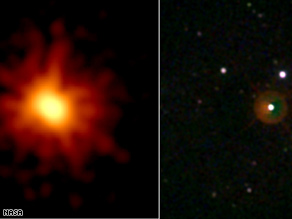

Stuff like this amazes me. Scientists just witnessed the largest explosion they’ve seen in space. It’s from a star 7.5 billion light years away.

What that means is that the actual star has been dead for 7.5 billion years, but we’re just seeing the light from the explosion now.

Poor star.