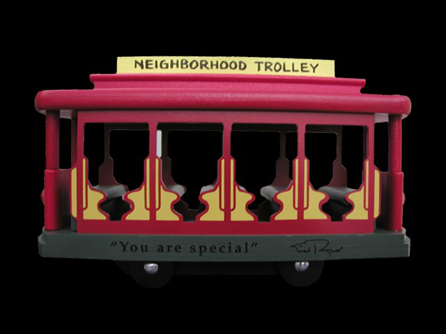

Ah yes. The sun is almost shining, and I had a good sleep. I free pretty good. I’m just packing my bags to head to Chilliwack for the day and hang out a bit with my nephew on his birthday. First order of business is to run downstairs and get some coffee though.

The best part is there’s still a pile of weekend left, so I can do some more relaxing back home on the couch. I’ll probably head back out to Vancouver tomorrow afternoon as I have some stuff I want to get finished up out here.

Also, I think it’s about time to take my Christmas tree down. What do you think?