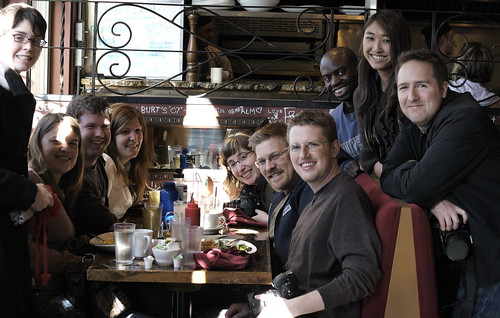

Yes, they are rare. I’m usually the guy with the camera. But looks like someone managed to snap a photo of me the last time I crawled away from the computer and into the light.

There are lots of people in the photo, and I’m sure I’ll miss some names. But from left to right are Alexa Booth, [Scott Hadfield](http://scotthadfield.ca/), Rebecca Holt, Ariane, [Boris Mann](http://bmannconsulting.com), [Matt Mullenweg](http://ma.tt), (up top now) [Phillip Jeffrey](http://fadetoplay.com/), Jessica Mah and me. This was the day after Northern Voice down at Havana on the Drive. Photo By Phillip’s camera.