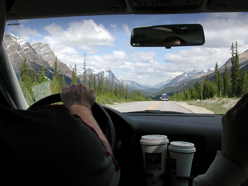

The one promise I made myself last year was that I was going to spend more time this summer doing the things I like. Number one on the list is of course my favourite past time, camping.

For the first time in most of my working life, I now get \*three\* weeks of vacation a year, as opposed to two (I should also point out many places outside of North America get four to six weeks of vacation a year), so I’m looking forward to spending more time in the wilderness this year. I sent out a few emails to some friends tonight to try and figure out somewhere to camp.

Since I have a few close friends out by Calgary I’m debating taking a week off in July and camping up around Banff. I did the same thing last year, but didn’t really have that much time to kill. While I might end up driving, part of me is thinking I’d just fly to Calgary with a backback full of camping gear, rent a car, and spend most of my time near a lake.

Given that I’m fairly used to city life these days, most people would probably be surprised to know that a few years ago I was pretty heavy into the outdoors. I spent most of my weekends hiking the various local hills, and even took a week off and did the west coast trail (which is why I am comfortable taking only a backpack to camp with).

Any campers amongst you readers?